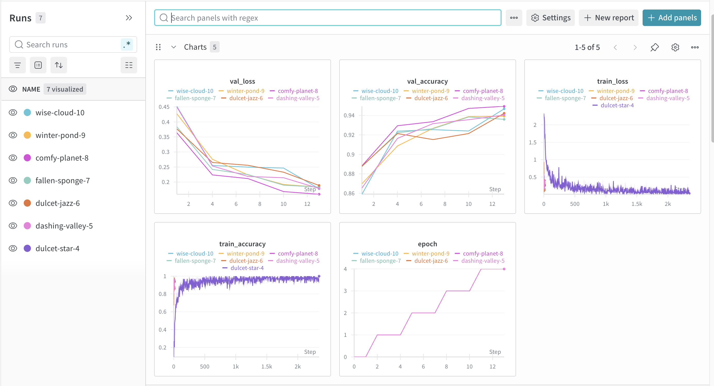
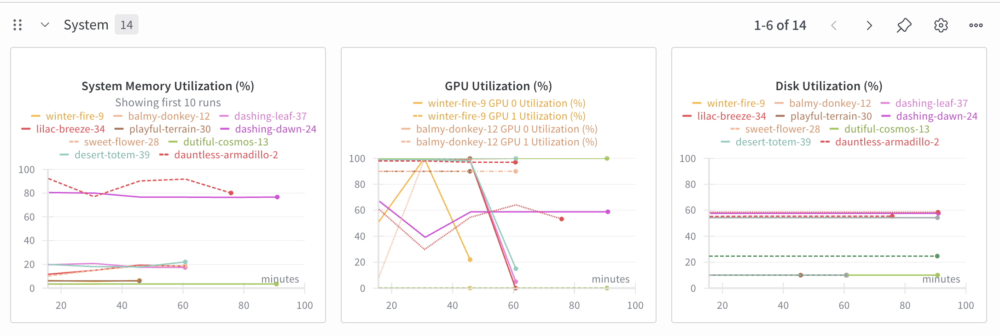
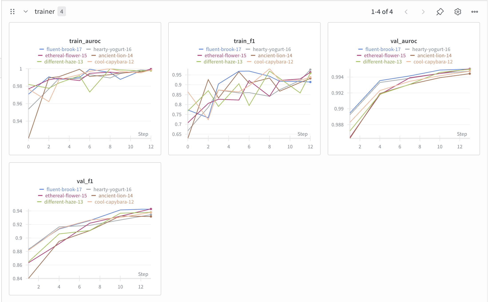
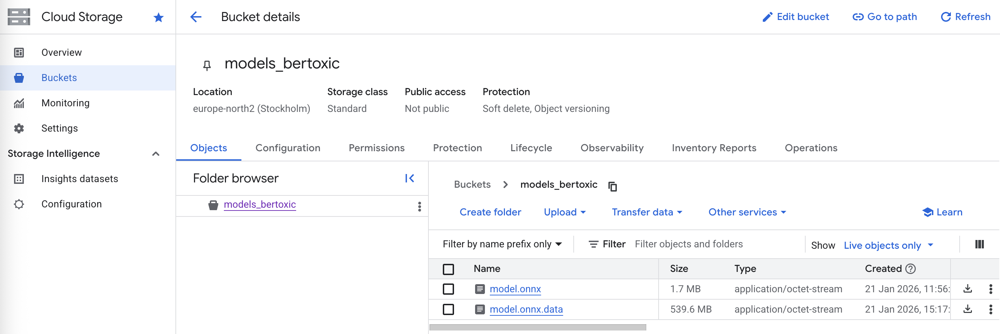
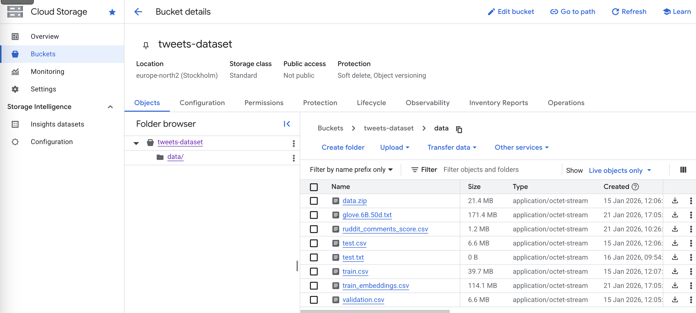

# Exam template for 02476 Machine Learning Operations

This is the report template for the exam. Please only remove the text formatted as with three dashes in front and behind
like:

```--- question 1 fill here ---```

Where you instead should add your answers. Any other changes may have unwanted consequences when your report is
auto-generated at the end of the course. For questions where you are asked to include images, start by adding the image
to the `figures` subfolder (please only use `.png`, `.jpg` or `.jpeg`) and then add the following code in your answer:

``

In addition to this markdown file, we also provide the `report.py` script that provides two utility functions:

Running:

```bash
python report.py html
```

Will generate a `.html` page of your report. After the deadline for answering this template, we will auto-scrape
everything in this `reports` folder and then use this utility to generate a `.html` page that will be your serve
as your final hand-in.

Running

```bash
python report.py check
```

Will check your answers in this template against the constraints listed for each question e.g. is your answer too
short, too long, or have you included an image when asked. For both functions to work you mustn't rename anything.
The script has two dependencies that can be installed with

```bash
pip install typer markdown
```

or

```bash
uv add typer markdown
```

## Overall project checklist

The checklist is *exhaustive* which means that it includes everything that you could do on the project included in the
curriculum in this course. Therefore, we do not expect at all that you have checked all boxes at the end of the project.
The parenthesis at the end indicates what module the bullet point is related to. Please be honest in your answers, we
will check the repositories and the code to verify your answers.

### Week 1

* [X] Create a git repository (M5) 
* [X] Make sure that all team members have write access to the GitHub repository (M5) 
* [X] Create a dedicated environment for you project to keep track of your packages (M2) 
    - @Flo
* [X] Create the initial file structure using cookiecutter with an appropriate template (M6) 
    - @FLo
* [X] Fill out the `data.py` file such that it downloads whatever data you need and preprocesses it (if necessary) (M6) 
    - Implement function that returns dataset as a Transformers Dataset object
    - @Rupak
* [X] Add a model to `model.py` and a training procedure to `train.py` and get that running (M6)
    - @Levi
* [-] Remember to fill out the `requirements.txt` and `requirements_dev.txt` file with whatever dependencies that you
    are using (M2+M6)
    - Skipped for now as we are using uv as a dependency manager.
* [X] Remember to comply with good coding practices (`pep8`) while doing the project (M7)
    - Use ```ruff``` for linting and formatting (add any customizations to `pyproject.toml`)
    - @Flo
* [X] Do a bit of code typing and remember to document essential parts of your code (M7)
    - @everyone
    - E.g.: use type hints in function signatures (arg+return) and docstrings for classes/functions
* [X] Setup version control for your data or part of your data (M8)
    - Data is version controlled using DVC in a GCP Bucket.
    - @Levi
* [X] Add command line interfaces and project commands to your code where it makes sense (M9)
    - Train and evaluation scripts are wrapped into invoke tasks. Arguments are passed via config files using Hydra.
    - @Levi
* [X] Construct one or multiple docker files for your code (M10)
    - @Rupak
* [X] Build the docker files locally and make sure they work as intended (M10)
    - @Rupak
* [X] Write one or multiple configurations files for your experiments (M11)
    - @Levi
* [X] Used Hydra to load the configurations and manage your hyperparameters (M11)
    - @Levi
* ([X]) Use profiling to optimize your code (M12)
    - @Flo
* [X] Use logging to log important events in your code (M14)
    - @Levi
    - Results are logged to Weights & Biases
* [X] Use Weights & Biases to log training progress and other important metrics/artifacts in your code (M14)
    - @Levi
* [-] Consider running a hyperparameter optimization sweep (M14)
    - Skipped because we already had adequate results with manual tuning.
* [X] Use PyTorch-lightning (if applicable) to reduce the amount of boilerplate in your code (M15)
    - @Levi
* [X] Use PyTorch-lightning (if applicable) to reduce the amount of boilerplate in your code (M15)
    - @Levi

### Week 2

* [X] Write unit tests related to the data part of your code (M16) 
    - @Flo
* [X] Write unit tests related to model construction and or model training (M16) 
    - @Flo
* [X] Calculate the code coverage (M16)
    - @Flo
* [X] Get some continuous integration running on the GitHub repository (M17)
    - @Flo
* [X] Add caching and multi-os/python/pytorch testing to your continuous integration (M17)
    - @Flo
* [X] Add a linting step to your continuous integration (M17)
* [X] Add pre-commit hooks to your version control setup (M18)
* [X] Add a continues workflow that triggers when data changes (M19)
    - @Levi
* [ ] Add a continues workflow that triggers when changes to the model registry is made (M19)
    - @Levi
* [X] Create a data storage in GCP Bucket for your data and link this with your data version control setup (M21)
    - @Levi
* [X] Create a trigger workflow for automatically building your docker images (M21)
    - @Levi
* [X] Get your model training in GCP using either the Engine or Vertex AI (M21)
    - @Levi
* [ ] Create a FastAPI application that can do inference using your model (M22)
    - @Rupak
* [ ] Deploy your model in GCP using either Functions or Run as the backend (M23)
    - @Rupak
* [ ] Write API tests for your application and setup continues integration for these (M24)
    - @Rupak
    - @Flo
* [ ] Load test your application (M24)
    - @Rupak
* [ ] Create a more specialized ML-deployment API using either ONNX or BentoML, or both (M25)
    - @Rupak
* [ ] Create a frontend for your API (M26)
    - @Rupak

### Week 3

* [X] Check how robust your model is towards data drifting (M27)
    We test model robustness using the Reddit toxic comments dataset (https://www.kaggle.com/datasets/estebanmarcelloni/ruddit-papers-comments-scored). This dataset was sourced from a different platform but inherently contains comments that are either toxic or not, therefore it makes a good candidate for testing data drift.
    1. We load the Reddit dataset and pass the comments through our inference API to obtain predictions.
    2. We then call the /monitoring endpoint of our API, which generates a data drift report comparing the Reddit dataset (current data) with our original training dataset (reference data).
    3. We also calculate the performance of our model quantified by accuracy, F1, ROCAUC scores on the Reddit dataset.
    - @Levi
* [X] Deploy to the cloud a drift detection API (M27)
    - The drift detection API is deployed in the same service as the prediction API, and it can be reached at `/monitoring` endpoint.
    - @Levi
* [ ] Instrument your API with a couple of system metrics (M28)
    - @Flo
* [ ] Setup cloud monitoring of your instrumented application (M28)
    - @Flo
* [ ] Create one or more alert systems in GCP to alert you if your app is not behaving correctly (M28)
    - @Flo
* [X] If applicable, optimize the performance of your data loading using distributed data loading (M29)
    In the configs/training.yaml file, num_workers can be configured to use multiple workers for data loading.
    - @Levi
* [ ] If applicable, optimize the performance of your training pipeline by using distributed training (M30)
    - @Rupak
* [ ] Play around with quantization, compilation and pruning for you trained models to increase inference speed (M31)
    - @Rupak

### Extra

* [ ] Write some documentation for your application (M32)
* [ ] Publish the documentation to GitHub Pages (M32)
* [ ] Revisit your initial project description. Did the project turn out as you wanted?
* [ ] Create an architectural diagram over your MLOps pipeline
* [ ] Make sure all group members have an understanding about all parts of the project
* [ ] Uploaded all your code to GitHub

## Group information

### Question 1
> **Enter the group number you signed up on <learn.inside.dtu.dk>**
>
> Answer:

100

### Question 2
> **Enter the study number for each member in the group**
>
> Example:
>
> *sXXXXXX, sXXXXXX, sXXXXXX*
>
> Answer:

s242957, s251969, s252684

### Question 3
> **A requirement to the project is that you include a third-party package not covered in the course. What framework**
> **did you choose to work with and did it help you complete the project?**
>
> Recommended answer length: 100-200 words.
>
> Example:
> *We used the third-party framework ... in our project. We used functionality ... and functionality ... from the*
> *package to do ... and ... in our project*.
>
> Answer:

We used the third-party framework **Transformers** from Hugging Face in our project. We used the `AutoTokenizer` for text preprocessing and tokenization, `AutoModelForSequenceClassification` for loading pretrained transformer models (specifically BERTweet), and `AutoConfig` for managing model configurations with custom label mappings. The framework was essential for implementing our toxic comment classification system, as it provided the pretrained language model backbone (`vinai/bertweet-base`) that we fine-tuned on our dataset. Additionally, we leveraged the framework's integration with PyTorch Lightning to streamline the training pipeline, and its tokenization utilities to handle Twitter-specific text normalization. This significantly accelerated development and allowed us to focus on MLOps infrastructure rather than building transformers from scratch.

## Coding environment

> In the following section we are interested in learning more about you local development environment. This includes
> how you managed dependencies, the structure of your code and how you managed code quality.

### Question 4

> **Explain how you managed dependencies in your project? Explain the process a new team member would have to go**
> **through to get an exact copy of your environment.**
>
> Recommended answer length: 100-200 words
>
> Example:
> *We used ... for managing our dependencies. The list of dependencies was auto-generated using ... . To get a*
> *complete copy of our development environment, one would have to run the following commands*
>
> Answer:

We used **uv** for managing our dependencies in this project. All dependencies are specified in the `pyproject.toml` file under the `[project.dependencies]` section for production dependencies and `[dependency-groups.dev]` for development dependencies. The `uv.lock` file ensures reproducible installations by locking exact versions of all dependencies and their transitive dependencies.

To get an exact copy of our development environment, a new team member would need to:

1. Install `uv` (if not already installed): `pip install uv`
2. Clone the repository
3. Navigate to the project root directory
4. Run `uv sync --all-group` to install all dependencies (both production and development)

This will automatically create a virtual environment and install all packages with the exact versions specified in the lock file. The project requires Python 3.12, which is specified in both `pyproject.toml` and `.python-version`. For PyTorch specifically, we configured `uv` to use the CPU-only PyTorch index to reduce dependency size, as defined in the `[tool.uv.sources]` section of `pyproject.toml`.


### Question 5

> **We expect that you initialized your project using the cookiecutter template. Explain the overall structure of your**
> **code. What did you fill out? Did you deviate from the template in some way?**
>
> Recommended answer length: 100-200 words
>
> Example:
> *From the cookiecutter template we have filled out the ... , ... and ... folder. We have removed the ... folder*
> *because we did not use any ... in our project. We have added an ... folder that contains ... for running our*
> *experiments.*
>
> Answer:

From the cookiecutter template we filled out the `src/` folder containing our main application code (`data.py`, `model.py`, `train.py`, `evaluate.py`), the `tests/` folder with unit tests for data and model components, the `configs/` folder with Hydra configuration files for training and evaluation, and the `dockerfiles/` folder with container definitions for training and API deployment. We also made use of the `tasks.py` file in the root directory and defined extra invoke commands for common operations like training and evaluation. We have added a gcp folder that contains scripts for deploying to Google Cloud Platform. We have removed the `notebooks/` folder as we did not use Jupyter notebooks in our workflow. 

### Question 6

> **Did you implement any rules for code quality and format? What about typing and documentation? Additionally,**
> **explain with your own words why these concepts matters in larger projects.**
>
> Recommended answer length: 100-200 words.
>
> Example:
> *We used ... for linting and ... for formatting. We also used ... for typing and ... for documentation. These*
> *concepts are important in larger projects because ... . For example, typing ...*
>
> Answer:

We used **ruff** for both linting and formatting our code. Ruff was configured in `pyproject.toml` with line length of 120 characters, and specific linting rules enabled (imports, errors, warnings, docstrings). We implemented **type hints** throughout our codebase using Python's type annotations for function parameters and return values. For documentation, we used **Google-style docstrings** for all classes and functions, which are enforced by ruff's docstring linting rules. We also implemented **pre-commit hooks** to automatically run ruff checks before each commit. These concepts are critical in larger projects because they ensure code consistency across team members, make the codebase more maintainable, catch bugs early through type checking, and provide clear documentation for future developers. Type hints particularly help with IDE autocomplete and make refactoring safer.

## Version control

> In the following section we are interested in how version control was used in your project during development to
> corporate and increase the quality of your code.

### Question 7

> **How many tests did you implement and what are they testing in your code?**
>
> Recommended answer length: 50-100 words.
>
> Example:
> *In total we have implemented X tests. Primarily we are testing ... and ... as these the most critical parts of our*
> *application but also ... .*
>
> Answer:

In total we have implemented 72 tests. Primarily we are testing the data loading and preprocessing pipeline (test_data.py with 16 tests), the datamodule and dataset classes (test_datamodule.py with 13 tests), model initialization and training steps (test_model.py with 13 tests), the FastAPI endpoints including /health and /predict (test_api.py with 12 tests), and our invoke tasks for docker operations (test_tasks.py with 6 tests). These cover the most critical parts of our application including data integrity validation, model forward pass and training, API request/response handling, and infrastructure automation. We also have tests for drift monitoring functionality that validate metrics calculations and API parameter handling.

### Question 8

> **What is the total code coverage (in percentage) of your code? If your code had a code coverage of 100% (or close**
> **to), would you still trust it to be error free? Explain you reasoning.**
>
> Recommended answer length: 100-200 words.
>
> Example:
> *The total code coverage of code is X%, which includes all our source code. We are far from 100% coverage of our **
> *code and even if we were then...*
>
> Answer:

Even with 100% code coverage, we would not trust the code to be completely error-free because coverage only measures which lines are executed, not the quality or completeness of the tests. It doesn't catch logical errors, edge cases not considered in tests, race conditions in concurrent code, or integration issues with external services. 

### Question 9

> **Did you workflow include using branches and pull requests? If yes, explain how. If not, explain how branches and**
> **pull request can help improve version control.**
>
> Recommended answer length: 100-200 words.
>
> Example:
> *We made use of both branches and PRs in our project. In our group, each member had an branch that they worked on in*
> *addition to the main branch. To merge code we ...*
>
> Answer:

Yes, we made use of both branches and pull requests in our project. Based on the checklist annotations (e.g., @Flo, @Levi, @Rupak), each member worked on specific features in their own branches. The main branch was protected, and code had to be merged through pull requests which allowed for code review before integration. This workflow helped us maintain code quality, catch bugs early through peer review, and avoid conflicts by keeping work isolated until it was ready to merge. Pull requests also served as documentation of what changes were made and why, providing context for future reference. Our CI/CD pipelines were configured to run on pull requests, ensuring that tests passed and code was properly formatted before merging.

### Question 10

> **Did you use DVC for managing data in your project? If yes, then how did it improve your project to have version**
> **control of your data. If no, explain a case where it would be beneficial to have version control of your data.**
>
> Recommended answer length: 100-200 words.
>
> Example:
> *We did make use of DVC in the following way: ... . In the end it helped us in ... for controlling ... part of our*
> *pipeline*
>
> Answer:

We did make use of DVC in our project to manage our toxic comments dataset. We configured DVC to use a Google Cloud Storage bucket as the remote storage backend. This is evidenced by the `data.dvc` file in the repository root and our `.github/workflows/cml_data.yaml` workflow that triggers on data changes. DVC helped us in several ways: (1) It kept our git repository lightweight by not storing large CSV files directly, (2) It enabled reproducibility by tracking exact versions of the dataset used for each experiment, (3) It facilitated team collaboration as multiple members could pull the same dataset versions, and (4) It integrated with our CI/CD pipeline through the CML workflow to automatically detect and validate data changes. This was particularly important as our training dataset contains 120,000 samples and our computed GLOVE embeddings file is ~109MB.

### Question 11

> **Discuss you continuous integration setup. What kind of continuous integration are you running (unittesting,**
> **linting, etc.)? Do you test multiple operating systems, Python  version etc. Do you make use of caching? Feel free**
> **to insert a link to one of your GitHub actions workflow.**
>
> Recommended answer length: 200-300 words.
>
> Example:
> *We have organized our continuous integration into 3 separate files: one for doing ..., one for running ... testing*
> *and one for running ... . In particular for our ..., we used ... .An example of a triggered workflow can be seen*
> *here: <weblink>*
>
> Answer:

We have organized our continuous integration into 4 separate workflow files: 

1. **tests.yaml** - Runs unit tests with pytest across multiple operating systems (Ubuntu, Windows, macOS), multiple Python versions (3.11, 3.12), and multiple PyTorch versions (2.6.0, 2.7.0). This uses matrix strategy for comprehensive testing and caching of uv dependencies for faster builds.

2. **linting.yaml** - Runs ruff linting and formatting checks to ensure code quality and style consistency.

3. **cml_data.yaml** - Triggers on data changes (via DVC), validates data integrity, and can optionally run training and post results as comments using CML (Continuous Machine Learning).

4. **pre-commit-update.yaml** - Automatically updates pre-commit hooks on a schedule to keep dependencies current.

All workflows use caching for uv dependencies and authenticate with GCP for accessing data and artifacts. An example workflow run can be seen in our tests.yaml which runs 18 different test configurations (3 OS × 2 Python × 2 PyTorch versions).

## Running code and tracking experiments

> In the following section we are interested in learning more about the experimental setup for running your code and
> especially the reproducibility of your experiments.

### Question 12

> **How did you configure experiments? Did you make use of config files? Explain with coding examples of how you would**
> **run a experiment.**
>
> Recommended answer length: 50-100 words.
>
> Example:
> *We used a simple argparser, that worked in the following way: Python  my_script.py --lr 1e-3 --batch_size 25*
>
> Answer:

We used Hydra for configuration management with YAML config files. Our main configuration files are `configs/training.yaml` and `configs/evaluation.yaml`. To run an experiment, you would use: `uv run invoke train` which internally calls `uv run src/toxic_comments/train.py`. Hydra automatically loads the training.yaml config, and you can override parameters using the syntax: `uv run src/toxic_comments/train.py data_dir=custom/path learning_rate=1e-4 batch_size=64`. All hyperparameters including batch_size (32), learning_rate (2e-5), epochs (2), max_length (128), and model_name_or_path (vinai/bertweet-base) are defined in the config files, making experiments easily reproducible and modifiable.

### Question 13

> **Reproducibility of experiments are important. Related to the last question, how did you secure that no information**
> **is lost when running experiments and that your experiments are reproducible?**
>
> Recommended answer length: 100-200 words.
>
> Example:
> *We made use of config files. Whenever an experiment is run the following happens: ... . To reproduce an experiment*
> *one would have to do ...*
>
> Answer:

We secured reproducibility through multiple mechanisms: (1) All hyperparameters are stored in Hydra config files (training.yaml, evaluation.yaml) which are version controlled in git, (2) Each experiment is logged to Weights & Biases which automatically captures the config file, git commit hash, and system information, (3) Model checkpoints are saved with their configs using PyTorch Lightning's built-in checkpoint system, (4) We use DVC to version control the exact dataset used for training, and (5) Our dependencies are locked in uv.lock file ensuring exact package versions. When an experiment runs, Hydra saves the complete config to the output directory under `outputs/YYYY-MM-DD/HH-MM-SS/.hydra/`, and W&B logs all metrics, artifacts, and system information. To reproduce an experiment, one would checkout the specific git commit, pull the correct data version with `dvc pull`, and run training with the saved config.

### Question 14

> **Upload 1 to 3 screenshots that show the experiments that you have done in W&B (or another experiment tracking**
> **service of your choice). This may include loss graphs, logged images, hyperparameter sweeps etc. You can take**
> **inspiration from [this figure](figures/wandb.png). Explain what metrics you are tracking and why they are**
> **important.**
>
> Recommended answer length: 200-300 words + 1 to 3 screenshots.
>
> Example:
> *As seen in the first image when have tracked ... and ... which both inform us about ... in our experiments.*
> *As seen in the second image we are also tracking ... and ...*
>
> Answer:

 We have tracked train and validation loss and accuracy. These metrics inform us about  the model's learning progress during training and whether it's overfitting or underfitting. The training loss decreases consistently, showing the model is learning, while validation loss and accuracy help us detect overfitting when validation metrics diverge from training metrics. Accuracy is important for classification tasks as it directly measures how often the model predicts the correct toxicity label. 

 In the second image, it can be seen that we monitored memory, GPU and disk utilization.  Monitoring these system metrics helps us optimize batch sizes and data loading strategies, and figure out any potential bottlenecks in training.

 As seen in the final image, we also tracked F1 and AUROC scores. F1 score is crucial for imbalanced datasets like ours, as it balances precision and recall, ensuring that both false positives and false negatives are minimized. AUROC provides insight into the model's ability to distinguish between classes across different threshold settings, which is important for evaluating overall model performance beyond just accuracy.

### Question 15

> **Docker is an important tool for creating containerized applications. Explain how you used docker in your**
> **experiments/project? Include how you would run your docker images and include a link to one of your docker files.**
>
> Recommended answer length: 100-200 words.
>
> Example:
> *For our project we developed several images: one for training, inference and deployment. For example to run the*
> *training docker image: `docker run trainer:latest lr=1e-3 batch_size=64`. Link to docker file: <weblink>*
>
> Answer:

For our project we developed three Docker images: one for training, second for the frontend and last one for API deployment. The training image (train.dockerfile) uses the uv base image, installs system dependencies, syncs Python packages, then crucially overrides the CPU-only PyTorch with GPU-enabled version (cu128) for Vertex AI training. To run the training docker image locally: `docker run trainer:latest`. The frontend.dockerfile is responsible for the user interface application (typically Streamlit in this context) and for the deployment, we have api.dockerfile for the FastAPI service. The docker images are automatically built and pushed to GCP Artifact Registry via Cloud Build triggers defined in `gcp/cloudbuild.yaml`. We also use invoke tasks to manage docker operations: `uv run invoke docker-build` and `uv run invoke docker-push`. Link to train dockerfile: [train.dockerfile](../dockerfiles/train.dockerfile) , api dockerfile: [api.dockerfile](../dockerfiles/api.dockerfile) and frontend dockerfile: [frontend.dockerfile](../dockerfiles/frontend.dockerfile)).

### Question 16

> **When running into bugs while trying to run your experiments, how did you perform debugging? Additionally, did you**
> **try to profile your code or do you think it is already perfect?**
>
> Recommended answer length: 100-200 words.
>
> Example:
> *Debugging method was dependent on group member. Some just used ... and others used ... . We did a single profiling*
> *run of our main code at some point that showed ...*
>
> Answer:

Debugging methods varied by team member and situation. We primarily used print statements and logging for quick debugging, and VS Code's debugger for interactive debugging sessions. For API debugging, we used FastAPI's automatic documentation at `/docs` and pytest's test client. We did perform profiling using Python's cProfile and snakeviz for visualization (included in dev dependencies). The profiling results are stored in `reports/profiles/prof.prof`. Profiling revealed that data loading could be optimized with multiple workers (configurable via `num_workers` in training.yaml). However, the code is far from perfect, there's always room for optimization in model inference speed and memory usage.

## Working in the cloud

> In the following section we would like to know more about your experience when developing in the cloud.

### Question 17

> **List all the GCP services that you made use of in your project and shortly explain what each service does?**
>
> Recommended answer length: 50-200 words.
>
> Example:
> *We used the following two services: Engine and Bucket. Engine is used for... and Bucket is used for...*
>
> Answer:

We used the following GCP services:

1. **Cloud Storage (Buckets)** - For storing datasets (tweets-dataset bucket with training data and GLOVE embeddings ~272MB) and prediction logs (predictions_db bucket). Also used as DVC remote storage.

2. **Artifact Registry** - For storing and versioning our Docker images (train and api images) that are built via Cloud Build.

3. **Cloud Run** - For automatically building and pushing Docker images when code changes, configured via cloudbuild.yaml and vertex_ai_train_cloudbuild.yaml.

4. **Vertex AI** - For training our models on GPU instances (T4 GPUs) in the cloud, triggered by Cloud Build.

4+1. **Google Cloud Storage API** (via google-cloud-storage Python library) - For programmatic access to buckets from our FastAPI application for downloading embeddings and managing predictions.

### Question 18

> **The backbone of GCP is the Compute engine. Explained how you made use of this service and what type of VMs**
> **you used?**
>
> Recommended answer length: 100-200 words.
>
> Example:
> *We used the compute engine to run our ... . We used instances with the following hardware: ... and we started the*
> *using a custom container: ...*
>
> Answer:

We primarily used Vertex AI for training rather than directly using Compute Engine VMs. Vertex AI runs our training jobs on managed compute with the following configuration: We used instances with T4 GPUs (specified in our training container) and the jobs were started using our custom Docker container from Artifact Registry (train:latest). The training configuration is defined in `gcp/train_config.yaml` and `gcp/vertex_ai_train_cloudbuild.yaml`. Vertex AI abstracts away the VM management, automatically provisions the hardware, runs our containerized training job, and tears down resources when complete, which is more cost-effective than maintaining persistent Compute Engine instances. Our Docker image installs PyTorch with CUDA 12.8 support to utilize the GPU acceleration.

### Question 19

> **Insert 1-2 images of your GCP bucket, such that we can see what data you have stored in it.**
> **You can take inspiration from [this figure](figures/bucket.png).**
>
> Answer:




### Question 20

> **Upload 1-2 images of your GCP artifact registry, such that we can see the different docker images that you have**
> **stored. You can take inspiration from [this figure](figures/registry.png).**
>
> Answer:

--- question 20 fill here ---

### Question 21

> **Upload 1-2 images of your GCP cloud build history, so we can see the history of the images that have been build in**
> **your project. You can take inspiration from [this figure](figures/build.png).**
>
> Answer:

--- question 21 fill here ---

### Question 22

> **Did you manage to train your model in the cloud using either the Engine or Vertex AI? If yes, explain how you did**
> **it. If not, describe why.**
>
> Recommended answer length: 100-200 words.
>
> Example:
> *We managed to train our model in the cloud using the Engine. We did this by ... . The reason we choose the Engine*
> *was because ...*
>
> Answer:

--- question 22 fill here ---

## Deployment

### Question 23

> **Did you manage to write an API for your model? If yes, explain how you did it and if you did anything special. If**
> **not, explain how you would do it.**
>
> Recommended answer length: 100-200 words.
>
> Example:
> *We did manage to write an API for our model. We used FastAPI to do this. We did this by ... . We also added ...*
> *to the API to make it more ...*
>
> Answer:

Yes, we were successful to write an API for our toxic comment classification model using the FastAPI. For the efficient model inference we have  utilised the ONNX Runtime, which is wrapped in lifespan. Additionally, the model weights are automatically downloaded from Google Cloud Storage (GCS) if they are missing locally. The ‘/health’ endpoint is to verify that the service is operational. The core function is ‘/predict’ which tokenizes the input text, runs the ONNX model, and applies a softmax function to calculate confidence scores which is used to retreive the correct output LABEL. This entire application is used in the [api.dockerfile](../dockerfiles/api.dockerfile) to streamline the deployment part.

### Question 24

> **Did you manage to deploy your API, either in locally or cloud? If not, describe why. If yes, describe how and**
> **preferably how you invoke your deployed service?**
>
> Recommended answer length: 100-200 words.
>
> Example:
> *For deployment we wrapped our model into application using ... . We first tried locally serving the model, which*
> *worked. Afterwards we deployed it in the cloud, using ... . To invoke the service an user would call*
> *`curl -X POST -F "file=@file.json"<weburl>`*
>
> Answer:

Yes, we have successfully utilised the Google Cloud Platform (GCP) for the deployment of our API on the cloud. We first wrapped our application logic into a Docker container. We tagged the local image and pushed it to the Google Artifact Registry in the europe-north2 region.

We deployed the backend on Google Cloud Run for the of serving backend infrastructure. We also deployed a Streamlit frontend that serves as a user interface for the model.

To invoke the API using Command Line, a user needs to sends a request with a to the /predict endpoint. Below given is a sample on how could you do it:

 *`curl -X POST <your-backend-app-url>/predict -H "Content-Type: application/json" -d '{"text": "example is the best thing”}`*

### Question 25

> **Did you perform any unit testing and load testing of your API? If yes, explain how you did it and what results for**
> **the load testing did you get. If not, explain how you would do it.**
>
> Recommended answer length: 100-200 words.
>
> Example:
> *For unit testing we used ... and for load testing we used ... . The results of the load testing showed that ...*
> *before the service crashed.*
>
> Answer:

For unit testing we used pytest with FastAPI's TestClient and unittest.mock for mocking external dependencies. We have 12 API-specific tests in test_api.py covering health checks, prediction endpoints with various inputs and error conditions, and proper status code handling. The tests mock model loading, GCS client, and database operations to run quickly without external dependencies. We have not yet performed formal load testing with tools like Locust or k6, but this would be important before production deployment to understand throughput limits, response times under load, and identify bottlenecks. Load testing would help determine optimal instance sizing and autoscaling thresholds for cloud deployment.

### Question 26

> **Did you manage to implement monitoring of your deployed model? If yes, explain how it works. If not, explain how**
> **monitoring would help the longevity of your application.**
>
> Recommended answer length: 100-200 words.
>
> Example:
> *We did not manage to implement monitoring. We would like to have monitoring implemented such that over time we could*
> *measure ... and ... that would inform us about this ... behaviour of our application.*
>
> Answer:

Yes, we implemented data drift monitoring in our deployed model through the `/monitoring` endpoint. The system works by: (1) Storing every prediction in GCS (predictions_db bucket), (2) When monitoring is requested, downloading reference training embeddings and GLOVE vectors from GCS, (3) Computing GLOVE embeddings for recent predictions to convert text to numerical features, (4) Using Evidently's DataDriftPreset to detect statistical drift across 50 embedding dimensions, (5) Calculating cosine similarity between reference and current data distributions, (6) Generating an interactive HTML report with drift metrics and visualizations. This helps longevity by alerting us when the input distribution shifts significantly from training data, indicating potential model performance degradation and need for retraining. We also tested robustness against the Reddit toxic comments dataset (different platform, similar task) and calculated accuracy, F1, and ROC-AUC metrics to quantify performance on drifted data.

## Overall discussion of project

> In the following section we would like you to think about the general structure of your project.

### Question 27

> **How many credits did you end up using during the project and what service was most expensive? In general what do**
> **you think about working in the cloud?**
>
> Recommended answer length: 100-200 words.
>
> Example:
> *Group member 1 used ..., Group member 2 used ..., in total ... credits was spend during development. The service*
> *costing the most was ... due to ... . Working in the cloud was ...*
>
> Answer:

--- question 27 fill here ---

### Question 28

> **Did you implement anything extra in your project that is not covered by other questions? Maybe you implemented**
> **a frontend for your API, use extra version control features, a drift detection service, a kubernetes cluster etc.**
> **If yes, explain what you did and why.**
>
> Recommended answer length: 0-200 words.
>
> Example:
> *We implemented a frontend for our API. We did this because we wanted to show the user ... . The frontend was*
> *implemented using ...*
>
> Answer:

--- question 28 fill here ---

### Question 29

> **Include a figure that describes the overall architecture of your system and what services that you make use of.**
> **You can take inspiration from [this figure](figures/overview.png). Additionally, in your own words, explain the**
> **overall steps in figure.**
>
> Recommended answer length: 200-400 words
>
> Example:
>
> *The starting point of the diagram is our local setup, where we integrated ... and ... and ... into our code.*
> *Whenever we commit code and push to GitHub, it auto triggers ... and ... . From there the diagram shows ...*
>
> Answer:

--- question 29 fill here ---

### Question 30

> **Discuss the overall struggles of the project. Where did you spend most time and what did you do to overcome these**
> **challenges?**
>
> Recommended answer length: 200-400 words.
>
> Example:
> *The biggest challenges in the project was using ... tool to do ... . The reason for this was ...*
>
> Answer:

--- question 30 fill here ---

### Question 31

> **State the individual contributions of each team member. This is required information from DTU, because we need to**
> **make sure all members contributed actively to the project. Additionally, state if/how you have used generative AI**
> **tools in your project.**
>
> Recommended answer length: 50-300 words.
>
> Example:
> *Student sXXXXXX was in charge of developing of setting up the initial cookie cutter project and developing of the*
> *docker containers for training our applications.*
> *Student sXXXXXX was in charge of training our models in the cloud and deploying them afterwards.*
> *All members contributed to code by...*
> *We have used ChatGPT to help debug our code. Additionally, we used GitHub Copilot to help write some of our code.*
> Answer:

fewafewubaofewnafioewnifowf ewafw afew afewafewafionewoanf waf ewonfieownaf fewnaiof newio fweanøf wea fewa
 fweafewa fewiagonwa ognwra'g
 wa
 gwreapig ipweroang w rag
 wa grwa
  g
  ew
  gwea g
  ew ag ioreabnguorwa bg̈́aw
   wa
   gew4igioera giroeahgi0wra gwa
